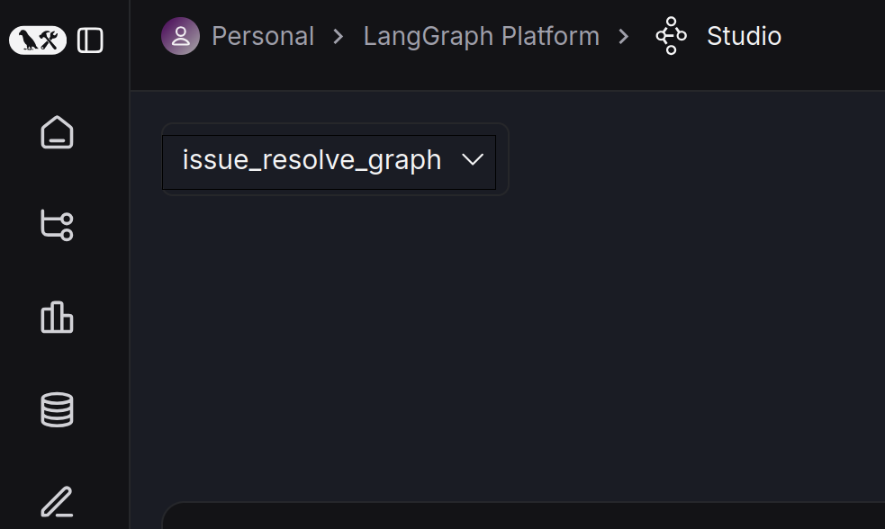
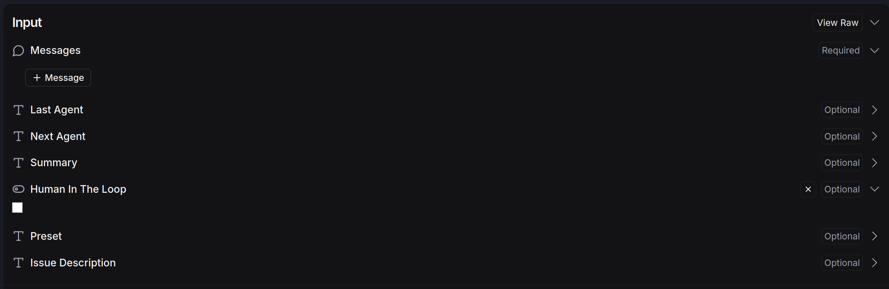
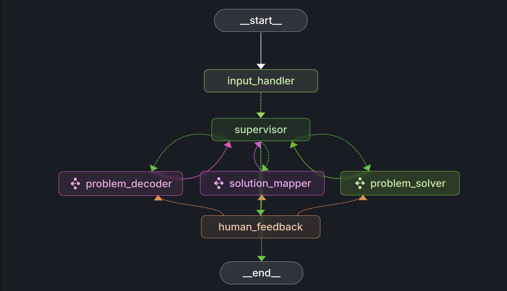
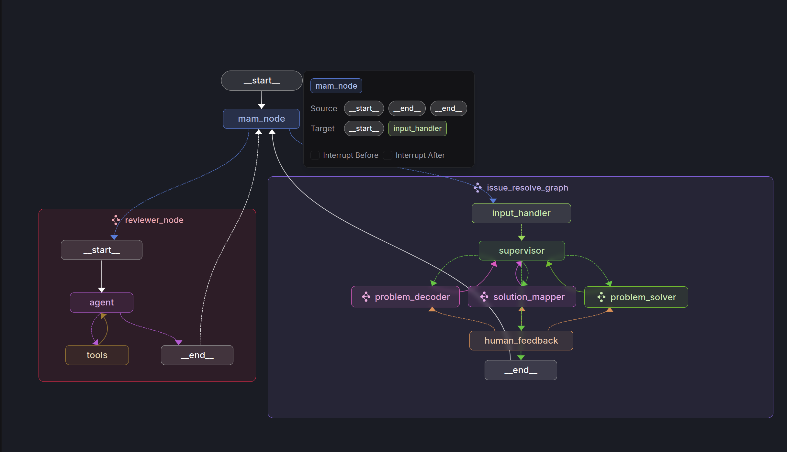
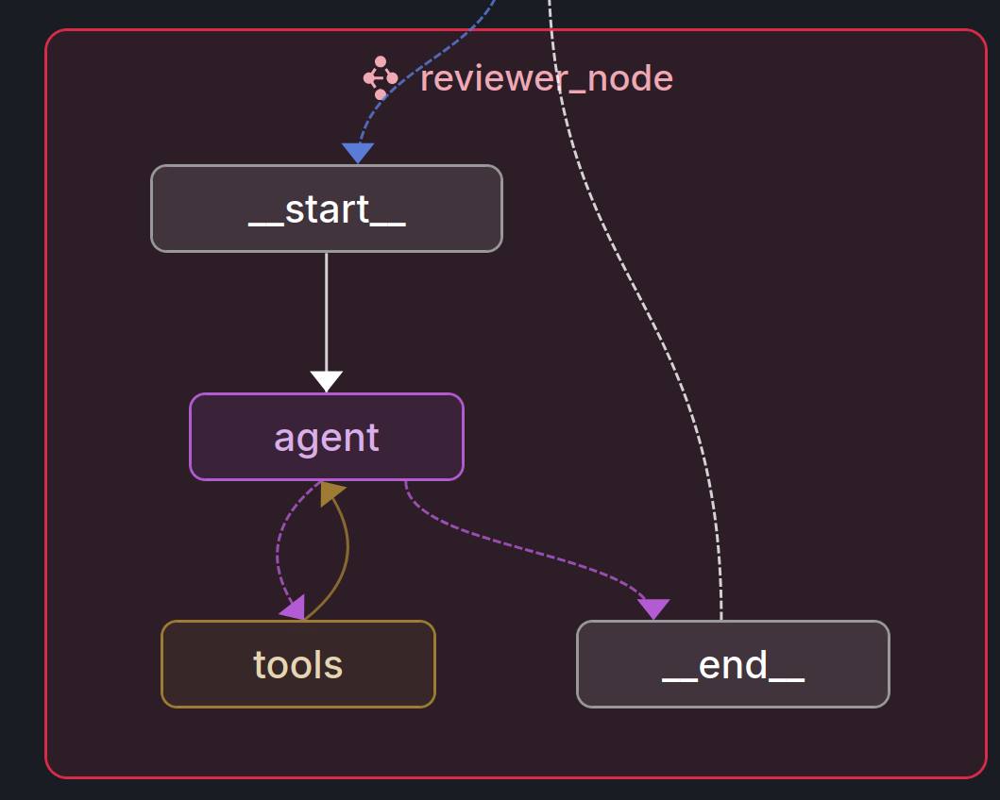

# Setup

## Part 1: Dependencies
- Dependencies are located in `pyproject.toml`, and can be installed with the following command:
	- `cd codexray_lite && pip install -e .`
- The installation command can be ignored if using `uv` package manager and `uv run` later on (see Run section for reference)
- It is suggested to use some package manager (e.g., venv, pipenv, uv, ...)
## Part 2: Environment Config
- The prototype requires the following environment variables to run:
	1. `LLM_PROVIDER`: The provider of the LLM to be used(e.g., "anthropic", "openai", "deepseek")
	2. `LLM_MODEL`: The model name of the LLM to be used (e.g., "claude-3-5-haiku-latest")
	3. The corresponding `LLM_PROVIDER` API key to be used
		- `LLM_PROVIDER="anthropic"`, set `ANTHROPIC_API_KEY`
		- `LLM_PROVIDER="openai"`, set `OPENAI_API_KEY`
		- `LLM_PROVIDER="deepseek"`, set `DEEPSEEK_API_KEY`
		- Additional provider integrations can be added, see [Langchain Chat Models](https://python.langchain.com/docs/integrations/chat/)
	4. `OPENAI_API_KEY`: The OpenAI API key to be used. Required for generating embeddings to build project knowledge.
	5. `GITHUB_TOKEN`: A GitHub API token used to automatically collect issue report information. It can be generated using a GitHub account through the following menus:
		- Profile > Settings > Developer Settings > Personal access tokens > Fine-grained tokens
- Place these environment variables in the `.env` file in the root of the project. This file will be loaded by the prototype on execution
# Run
- The prototype can be ran with either of the following commands:
	- `langgraph dev --no-reload` (if installed via `pip`)
	- `uv run --env-file .env langgraph dev --no-reload` (if using `uv`)
- The prototype will create a local instance of LangGraph Studio and will open a browser instance to the page once the prototype is run
- Once in the UI, select the graph to run at the top left



- Add a Message by clicking "+ Message" button, and add the Github issue URL. An example URL is: https://github.com/gitpython-developers/GitPython/issues/1977


- Finally click the Submit button
- Note that human feedback functionality is disabled be default, it can be enabled by clicking the checkbox in the LangGraph Studio UI before submitting the issue URL:

# Agents
- The prototype currently consists of five main agents across the graphs and implemented in various LangGraph nodes
## Multi-Agent Manager
- The multi-agent manager coordinates between the issue resolver and reviewer agents to provide feedback and or guidance to each step. 
- Only used in `src/agent/hierarchy_graph_demo.py`. 
- Prompt in `src/agent/prompt/mam.py`
## Supervisor
- The supervisor oversees the entire workflow of solving the issue, and decides which agent to route to depending on the current progress of the issue.
- Prompt in `src/agent/prompt/supervisor.py`
## Problem Decoder
- The problem decoder analyzes and understands the issue requirements to generate a problem statement consisting of a topic question, codebase representation (i.e., bug localization), the current behaviour, and the expected behaviour.
- Uses tools `[view_directory, search_relevant_files, view_file_content]`
- Prompt in `src/agent/prompt/problem_decoder.py`

## Solution Mapper
- The solution mapper reviews the information from the problem decoder with respect to the localized bug and the codebase, to then generate a detailed code change plan for each of the files and or functions.
- Uses tools `[view_directory, search_relevant_files, view_file_content]`
- Prompt in `src/agent/prompt/solution_mapper.py`
## Problem Solver
- The problem solver implements the proposed change plan from the solution mapper by modifying files
- Uses tools `[view_directory, search_relevant_files, str_replace_editor]`
- Prompt in `src/agent/prompt/problem_solver.py`
## Reviewer
- The reviewer verifies the proposed fix resulting from the issue resolver agent by generating and executing test cases.
- Only used in `src/agent/hierarchy_graph_demo.py`
- Uses tools `[view_directory, search_relevant_files, view_file_content, run_shell_cmd]`
- Prompt in `src/agent/prompt/reviewer.py`

# Tools
- There are five main tools are defined and used by multiple agents in the workflow of the prototype
- Note that tools used by agents are:
	- Defined with the `@tool` wrapper
	- Defined while constructing the agent via `create_react_agent` using`tools` parameters

## view_directory
- View the file structure of the repository, including directories (marked with /).
    Automatically reduces depth if entries exceed 50.
    Args:
        dir_path (str): Starting directory. Defaults to './'.
        depth (Optional[int]): Maximum depth. None for unlimited. Defaults to None.
    Returns:
        List[str]: Sorted list of directories (with /) and files.
- Defined in `src/agent/tool_set/sepl_tools.py`
## view_file_content
- Read the content of the specified file.
    Parameters:
        file_name (str): File name relative to the git root directory.
        view_range (Optional[List[int]): Optional list containing [start_line, end_line] to limit the lines displayed.
    Usage:
        - LLM should initially attempt to read the entire file content.
        - If the file is too large, LLM can use the `view_file_structure` tool to identify relevant code ranges,
          and then call this tool again specifying the `view_range` to read only the necessary lines.
    Returns:
        str: Content of the file or the specified line range.
- Defined in `src/agent/tool_set/sepl_tools.py`

## run_shell_cmd
- Run a list of shell commands in sequential order and return the stdout results, your working directory is the root of the project
	Args:
        commands (List[str]): A list of shell commands to be run in sequential order.
        config (RunnableConfig) The runtime configuration.
    Returns:
        str: Result of running the commands.
- Defined in `src/agent/tool_set/sepl_tools.py`


## search_relevant_files
- Given a query search string (for example, the issue report description, filenames, etc), search for relevant code snippets of files in the project by calculating embedding similarity between the query and code snippets in a vector database.
    Args:
        query: A search string (for example, the issue report description, filenames, etc), to be used to find relevant files and functions.
	Returns:
		explanations (str): Each retrieved file with an explanation of how the file is relevant to the query. 
- This tool builds a local Vector DB using `ChromaDB` at the location defined in `src/agent/config.py:RUNTIME_DIR` by indexing all Java/Python files in the project.
- Used by the `search_relevant_files` tool.
- Defined in `src/agent/tool_set/context_tools.py`
## str_replace_editor
- Custom editing tool for viewing, creating and editing files in plain-text format
    * State is persistent across command calls and discussions with the user
    * If `path` is a file, `view` displays the result of applying `cat -n`. If `path` is a directory, `view` lists non-hidden files and directories up to 2 levels deep
    * The `create` command cannot be used if the specified `path` already exists as a file
    * If a `command` generates a long output, it will be truncated and marked with `<response clipped>`
    Args:
        command (str): The commands to run. Allowed options are: `view`, `create`, `str_replace`, `insert`.
        path (str): Absolute path to file or directory, e.g. `/workspace/file.py` or `/workspace`.
        file_text (Optional[str]): Required parameter of `create` command, with the content of the file to be created.
        old_str (Optional[str]): Required parameter of `str_replace` command containing the string in `path` to replace.
        new_str (Optional[str]): Optional parameter of `str_replace` command containing the new string (if not given, no string will be added). Required parameter of `insert` command containing the string to insert.
        insert_line (Optional[int]): Required parameter of `insert` command. The `new_str` will be inserted AFTER the line `insert_line` of `path`.
        view_range (Optional[List[int]): Optional parameter of `view` command when `path` points to a file. If none is given, the full file is shown. If provided, the file will be shown in the indicated line number range, e.g. [100, 600] will show content between line 100 and 600. Indexing at 1 to start. Setting `[start_line, -1]` shows all lines from `start_line` to the end of the file. Unless you are sure about the line numbers, otherwise, do not set this parameter and use the `view` command to view the whole file.
- Defined in `src/agent/tool_set/edit_tool.py`


# Graphs

- There are currently two developed graphs in the prototype
	1. `src/agent/supervisor_graph_demo.py`
	2. `src/agent/hierarchy_graph_demo.py`

## Supervisor Graph

- This graph defines a workflow to resolve an issue given the issue requirements, with use of a supervisor agent and integrated with human feedback
- The graph is defined in the `issue_resolve_graph` variable and contains the following six nodes:
	1. `input_handler_node`: This node handles the start of the workflow by setting up the runtime environment given the Github issue report URL.
	2. `supervisor_node`: This node executes the supervisor agent.
	3. `problem_decoder`: This node executes the problem decoder agent.
	4. `solution_mapper`: This node executes the solution mapper agent.
	5. `problem_solver`: This node executes the problem solver agent.
- Human feedback: After each node is executed, the result is provided to the user for human feedback if enabled
	- Recall human feedback is disabled by default, see Run section on how to enable it
	- If the human provides feedback, the same node will be re-executed with the additional feedback information
	- If the human provides no feedback, the workflow will continue


## Hierarchy Graph

- This graph defines a workflow also to resolve an issue, though also implements a multi-agent manager to coordinate between an issue resolver agent (i.e. the graph from [[CodeXRay Lite Documentation#Supervisor Graph]) and a reviewer agent, to review the result of the issue resolver agent, and also includes human feedback.
- The graph is defined in the `hierarchy_graph` variable and contains the following three nodes:
	1. `mam_node`: This node executes the multi-agent manager agent.
	2. `issue_resolve_graph`: This node executes the issue resolver agent, combining all nodes and agents defined in [[CodeXRay Lite Documentation#Supervisor Graph]
	3. `reviewer_node`: This node executes the reviewer agent.

# Development

## Adding agents
- Agents are generally defined via:
	1. System prompt (optional)
	2. User prompt or past conversation history
	3. Tools (optional)
- In Langgraph, there are multiple ways to create and define agents depending on their purpose
- See [Langgraph Documentation: Build an Agent](https://python.langchain.com/docs/tutorials/agents/) for more information, or view the related graph files in our project
### Tool-less Agents
- These agents are defined to be used without tools
- In this case, the LLM can be used directly

```python
from langchain_anthropic import ChatAnthropic
llm = ChatAnthropic(model="claude-3-5-haiku-latest", temperature=0.0)
response = llm.invoke("Tell me a joke") # Single string input
response = llm.invoke(["What is 2+2", "What is the previous result times 5"]) # List of string as input
```
### ReACT Agents
- These agents are defined with tools which they will decide to use on their own time
- In this case, the agent should be created using [`create_react_agent`](https://langchain-ai.github.io/langgraph/reference/prebuilt/#langgraph.prebuilt.chat_agent_executor.create_react_agent), and will expect different input (see [[CodeXRay Lite Documentation#Agent Expected Input and State])
```python
from langchain_anthropic import ChatAnthropic
from langgraph.prebuilt import create_react_agent
from langchain_core.messages import HumanMessage

llm = ChatAnthropic(model="claude-3-5-haiku-latest", temperature=0.0) # Create LLM
tools = [math_tool] # Tool example
problem_solver_agent = create_react_agent(
    llm,
    tools=problem_decoder_tools, # Required for ReACT agents
    prompt="You must solve the given problems!" # Optional system prompt
)
problem_solver_agent.invoke({"messages": [
	HumanMessage(content="What is 2+2")
]}) # How to invoke the agent using user prompt "What is 2+2"
```
- ReACT agents also create a subgraph that includes the looks like so:

### Agent Expected Input and LangGraph State
- Different agent creation methods will expect different inputs
- An agent without tools used directly from a class such as `ChatAnthropic` can  expect relatively flexible inputs:
	- A string
	- A list of strings
	- A list of `BaseMessage` - usually their subclasses (i.e., `SystemMessage`, `HumanMessage`, `AIMessage`, ..)
- When defining and invoking a ReACT agent, it will instead expect more structured input involving a `MessagesState` object, known as the LangGraph state
	- The `MessagesState` holds and defines the conversation history of the current run, as well as any additional variables if a custom State class is defined (e.g., see `src/agent/state.py:CustomState)
	- The `MessagesState` must be a dictionary (`dict`, `AnnotatedDict`) with the `messages` (the convo history) key as a list of `BaseMessages` - usually their subclasses (i.e., `SystemMessage`, `HumanMessage`, `AIMessage`, ..)
	- The messages in the state is updated automatically by the Langgraph graph within the defined nodes in the graph
	- Custom variables can be updated when returning from each node using the `update` kwarg in the `Command` class (e.g., `Command(update={"custom_var": 2"}))
- It is important to note that the `messages` of `MessagesState` follows strict structure when being invoked by ReACT agents and may be difficult to alter
	- The main reason is that if an agent uses a tool, the `AIMessage` of the agent will be proceeded by a `ToolMessage` containing information of the corresponding tool
	- If one or the other message is removed from the state, the workflow will break

### System Prompts
- Note that a system prompt can take different forms in LangGraph:
	- `prompt` kwarg of `create_react_agent` (str): This is converted to a SystemMessage and added to the beginning of the list of messages in state["messages"].
	- SystemMessage: this is added to the beginning of the list of messages in state["messages"].
	- Callable: This function should take in full graph state and the output is then passed to the language model.
	- Runnable: This runnable should take in full graph state and the output is then passed to the language model.

## Adding tools
- Tools can be considered as Python functions that can be used by agents/LLM (defined via `create_react_agent`)
- These are defined using the `@tool` decorator (`from langchain_core.tools import tool`), and require docstring explaining the function, the args, and expected return info
	- This information is passed to the agent as context for using the function
	- Instead of defining args in the docstring, type hints can be used which will be parsed and sent to the agent as well
```python
# tools.py
from langchain_core.tools import tool

# Via type hints
@tool
def multiply(a: int, b: int) -> int:
    """Multiply two numbers."""
    return a * b

from typing import Annotated, List
# Via annotated type hints
@tool
def multiply_by_max(
    a: Annotated[int, "scale factor"],
    b: Annotated[List[int], "list of ints over which to take maximum"],
) -> int:
    """Multiply a by the maximum of b."""
    return a * max(b)
```

- Once tools are created, they can be linked to agents via the `tools` keyword in the `create_react_agent` constructor:
```python
# graph.py
from langchain_anthropic import ChatAnthropic
from langchain_core.messages import HumanMessage
from langgraph.prebuilt import create_react_agent

from tools import multiply, multiply_by_max # Load the example tools above

llm = ChatAnthropic(model="claude-3-5-haiku-latest", temperature=0.0)
tools = [multiply, multiply_by_max] # Define the tools for the agent using the created tools above
problem_solver_agent = create_react_agent(
    llm,
    tools=problem_decoder_tools, # Required for ReACT agents
    prompt="You must solve the given problems!" # Optional system prompt
)

# Example prompts
problem_solver_agent.invoke({"messages": [
	HumanMessage(content="What is 2*5")
]}) 
problem_solver_agent.invoke({"messages": [
	HumanMessage(content="What is 2 mutlipled by the max of this list: [5, 10, 15]")
]})
```
- Additional info can be read on [Langchain Documentation: How to create tools](https://python.langchain.com/docs/how_to/custom_tools/), or view the related tool files in our project

## Creating graphs
- A graph defines a multi-agent workflow, that generally follows these steps:
1. Create a Python file for the graph
2. Define agents
3. Define nodes for each agents where they will be invoked, containing the logic that will happen before/after their individual invocation.
4. Build the graph using `StateGraph` (base class for graph), constructing edges between the defined nodes, and with a State (e.g., `MessagesState`), 
	- Consider implementing an edge to `END` node (automatically included in every graph) to manually define when to terminate the workflow
5. Define a variable for the compiled graph using `graph.compile()` 
6. Create a new entry in `langgraph.json` in the format of `path_to_graph_file.py:compiled_graph_var`

```python
# 1. Create the graph file: graph.py
from langchain_anthropic import ChatAnthropic
from langchain_core.messages import HumanMessage
from langgraph.prebuilt import create_react_agent
from langgraph.graph import MessagesState, StateGraph, END

# 2. Define agents
from .tools import multiply, multiply_by_max # Load the example tools above

llm = ChatAnthropic(model="claude-3-5-haiku-latest", temperature=0.0)
tools = [multiply, multiply_by_max] # Define the tools for the agent using the created tools above
problem_solver_agent = create_react_agent(
    llm,
    tools=problem_decoder_tools, # Required for ReACT agents
    prompt="You must solve the given problems!" # Optional system prompt
)

# 3. Define nodes
def problem_solver_node(state: MessagesState):
	response = problem_solver_agent.invoke(state) # Invoke the problem solver on the messages
	new_messages = response["messages"][len(state["messages"]):] # Simple processing: only get the new messages from this LLM invocation
	return new_messages

# 4. Build the graph
workflow = StateGraph(MessagesState)
workflow.add_edge(START, "problem_solver") # Begin the workflow by entering the problem_solver
# Add the problem_solver agent node
workflow.add_node("problem_solver", problem_solver_node)
# Add the END node to terminate the workflow after the problem_solver is done
workflow.add_edge("problem_solver", END)

# 5. Compile the graph
graph = workflow.compile()

# Example prompts
problem_solver_agent.invoke({"messages": [
	HumanMessage(content="What is 2*5")
]}) 
problem_solver_agent.invoke({"messages": [
	HumanMessage(content="What is 2 mutlipled by the max of this list: [5, 10, 15]")
]})
```
- Step 6: Define the graph in langgraph.json
```json
{
  "dependencies": ["."],
  "graphs": {
    "demo_graph": "graph.py:graph",
    "hierarchy_graph": "./src/agent/hierarchy_graph_demo.py:hierarchy_graph"
  },
  "env": ".env"
}
```

- Additional information can be found via the Langgraph Documentation, or view the related graph files in our project

## Creating subgraphs
- Subgraphs (graphs within the graph) can be created
- An example of this is our Hierarchy Demo graph, which uses the Issue resolve graph as a subgraph
```python
# hierarchy_graph_demo.py
...
from langgraph.graph import END, START, StateGraph
from agent.supervisor_graph_demo import issue_resolve_graph
...
builder = StateGraph(CustomState)
builder.add_node(
    "issue_resolve_graph",
    issue_resolve_graph,
    destinations=({"mam_node": "mam_node-issue_resolve_graph"}),
) # Creates the issue_resolve_graph node subgraph, and define an edge from mam_node to issue_resolve_graph
builder.add_node(
    "mam_node",
    mam_node,
    destinations=(
        {
            "reviewer_node": "mam_node-reviewer_node",
            "issue_resolve_graph": "mam_node-issue_resolve_graph",
        }
    ),
) # Create the multi-agent manager node and define edges between mam_node to reviewer_node, and mam_node back to issue_resolve_graph
builder.add_node(
    "reviewer_node",
    reviewer_node,
    destinations=({"mam_node": "mam_node-reviewer_node"}),
) # Create the reviewer node and define an edge from mam_node to reviewer node
builder.add_edge(START, "mam_node") # Define start
builder.add_edge("issue_resolve_graph", "mam_node") # Finally add the edge from issue_resolve_graph and mam_node
hierarchy_graph = builder.compile() # Compile the graph
```
- Note that a subgraph is also created when creating a node that includes a ReACT based agent as mentioned above
- A reACT agent subgraph consits of nodes including:
	- `__start__`: Defines the start of the subgraph
	- `agent`: The agent that was defined and will be used within the node
	- `tools`: The tools bound to the agent via the `tools` kwarg
	- `__end__`: Defines the end of the subgraph
	- Note that conditional edges are illustrated via dashed lines, and mean that the agent will decide on its own whether to transition to that node on its own depending on certain critera (e.g., if it recognizes it requires tool use)
- More info can be found on the [Langgraph Documentation: How to use subgraphs](https://langchain-ai.github.io/langgraph/how-tos/subgraph/), or view the Multi-agent Manager related graph file in our project (`src/agent/hierarchy_graph_demo.py`)

# Additional Documentation


## File Structure
```
.
├── langgraph.json
├── pyproject.toml
├── src
│   └── agent
│       ├── constant.py
│       ├── github_utils.py
│       ├── hierarchy_graph_demo.py
│       ├── __init__.py
│       ├── llm.py
│       ├── parsers.py
│       ├── prompt
│       │   ├── context_manager.py
│       │   ├── __init__.py
│       │   ├── mam.py
│       │   ├── problem_decoder.py
│       │   ├── problem_solver.py
│       │   ├── reviewer.py
│       │   ├── solution_mapper.py
│       │   └── supervisor.py
│       ├── runtime_config.py
│       ├── state.py
│       ├── supervisor_graph_demo.py
│       ├── tool_set
│       │   ├── constant.py
│       │   ├── context_tools.py
│       │   ├── edit_history.py
│       │   ├── edit_tool.py
│       │   ├── linter
│       │   │   ├── base.py
│       │   │   ├── impl
│       │   │   │   ├── python.py
│       │   │   │   ├── treesitter_compat.py
│       │   │   │   └── treesitter.py
│       │   │   ├── __init__.py
│       │   │   ├── linter.py
│       │   ├── oheditor.py
│       │   ├── sepl_tools.py
│       │   └── utils.py
│       └── utils.py
```
## Dir /
### langgraph.json
- Defines configuration for the execution of the `langgraph dev` command, currently including:
	- The Python file(s) containing LangGraph graphs and the variable name(s) in the corresponding file(s) defining the graph
	- The location of the `.env` file
- More information can be found in [LangGraph Application Structure](https://langchain-ai.github.io/langgraph/concepts/application_structure/)
### pyproject.toml
- Defines all dependencies to run the prototype, which should be changed accordingly to corresponding additional dependencies

## Dir src/agent/
- Contains files defining the main workflow and structure of the prototype
### constant.py
- Defines several constant variables used throughout the prototype.
	- `RUNTIME_DIR`: Defines the local location where files will be stored
	- `PATCH_RESULT_DIR`: Defines where resulting patches will be stored.
	- `REQUEST_TIMEOUT`: Defines the amount of seconds before web requests via `requests` library timeout.
	- `PY_LANGUAGE`,`JAVA_LANGUAGE`: Defines tree-sitter parsers used for file indexing.
### github_utils.py
- Defines functions for using Github API to collect git-based information (e.g., issue report)
	- `get_issue_description`: Retrieves the issue description given the owner, project name, and issue ID
	- `get_issue_close_commit`: Retrieves the commit that closed the pull request corresponding to a given issue
- Remember to define `GITHUB_TOKEN` environment variable in the `.env` for expected behaviour of this functionality
### llm.py
- Defines the LLM based on the `LLM_PROVIDER` and `LLM_MODEL` env vars.
	- `create_llm`: Creates the LLM according to `LLM_PROVIDER` and `LLM_MODEL` env vars
- Remember to define `LLM_PROVIDER`, `LLM_MODEL`, and the corresponding API token environment variables in the `.env` for expected behaviour of this functionality
### parsers.py
- Defines parsers used to extract information from LLM responses
	- `relevant_file_explanations_parser`: A parser to extract file paths and explanations from JSON formatted LLM responses
### runtime_config.py
- Handles all runtime environment configuration setup. Currently supports loading runtime environment using a GitHub issue URL.
	- `RuntimeConfig`: Singleton class to hold and setup runtime configuration. Each configuration loading entry point starts with `load_from`.
	- `RuntimeConfig.load_from_github_issue_url`: Setup the runtime config based on a given issue UR;
		Args:
			issue_url: The given issue URL
### state.py
- Defines the custom state structures for the prototype.
### utils.py
- Defines various util functions for the prototype.
## Dir src/agent/prompt/
- Contains files defining the prompts for each agent, and prompts for other steps of the prototype (multi-agent manager, supervisor, problem decoder, solution mapper, problem solver, reviewer)

### context_manager.py
- Contains prompts relevant to context management
- `RELEVANT_FILE_EXPLANATION_SYSTEM_PROMPT`: A prompt used in `search_relevant_files` tool to ask LLM to explain the relevancy of files retrieved from the vector DB.

## Dir src/agent/tool_set/
- Contains files defining the tools used by agents
### constant.py
- Defines several constant variables used throughout the tools. 
### context_tools.py
- Defines context management tools
	- `EMBEDDING_FUNCTION`: Defines the embedding model for the Vector DB with use of the `search_relevant_files` tool. Currently uses `OpenAIEmbeddings` and requires `OPENAI_API_KEY` environment variable in `.env`.
	- `PROJECT_KNOWLEDGE_TEXT_SPLITTER`: Defines the text splitter for the Vector DB with use of the `search_relevant_files` tool.
	- `create_project_knowledge`: Creates the project knowledge component. Indexes all Java and Python files in the directory of the corresponding issue. Builds a local VectorDB using `ChromaDB` at the location defined in `src/agent/config.py:RUNTIME_DIR`. The algorithm differentiates between functions/methods and other code by using `tree-sitter`. Used by the `search_relevant_files` tool.
	- `summarizer`: Summarizes the information of the chat history/workflow and aggregates it into detailed steps. Used at each step in the supervisor agent.

### edit_history.py
- History management for file edits with disk-based storage and memory constraints for OHEditor
- Adapted from OpenHands file editor. For more information refer to https://github.com/All-Hands-AI/openhands-aci/blob/main/openhands_aci/editor/editor.py

### edit_tool.py
- Enables file edits via OHEditor
- Adapted from OpenHands file editor. For more information refer to https://github.com/All-Hands-AI/openhands-aci/blob/main/openhands_aci/editor/editor.py

### oheditor.py
- OHEditor is a filesystem editor tool that allows the agent to
    - view
    - create
    - navigate
    - edit files
- Adapted from OpenHands file editor. For more information refer to https://github.com/All-Hands-AI/openhands-aci/blob/main/openhands_aci/editor/editor.py

### sepl_tools.py
- Defines software Engineering Project Lifecycle tools
	- `extract_git_diff_local`: Executes and returns the `git diff` command in a local runtime environment.
	- `save_git_diff`: Exports the result of the `git diff` command.
### utils.py
- Defines util functions used by OHEditor
- Adapted from OpenHands file editor. For more information refer to https://github.com/All-Hands-AI/openhands-aci/blob/main/openhands_aci/editor/editor.py
## Dir src/agent/tool_set/linter/
- Defines functionality for the linter used in OHEditor
- Adapted from Aider linter. For more information refer to https://github.com/paul-gauthier/aider/blob/main/aider/linter.py


# Additional Notes

## Space Limitations
### Cloned Repos
- When submitting a URL, a local copy of the repository will be cloned at a specific commit, either:
	- The most recent commit, or
	- The commit before the commit that was merged in the pull request fixing the issue (if applicable)
- This will take up considerable amount of space overtime, so be sure to clean the directory corresponding to `src/agent/constant.py:RUNTIME_DIR`

### `search_relevant_files` Vector DBs
- If using the `search_relevant_files` tool, a vector/Chroma DB will be built for each issue submitted
- This will take up considerable amount of space overtime, so be sure to clean the directory corresponding to `src/agent/constant.py:RUNTIME_DIR`
